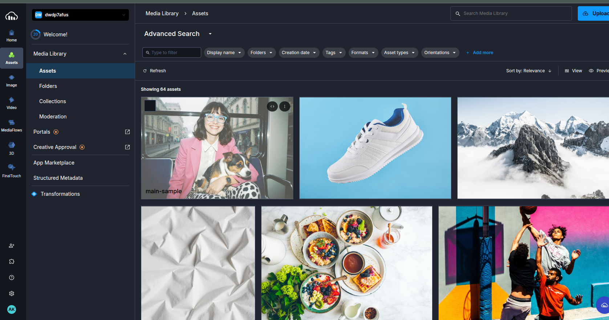
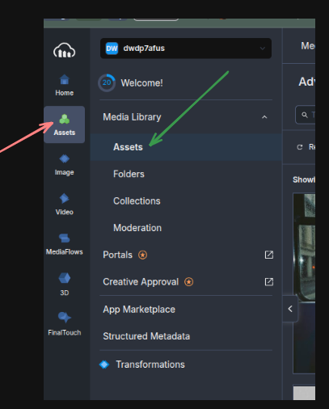

# Cloudinary To Manage Your Media Files

_October ??, 2025_

While following the course of TheOdinProject, I was given a project to build a file uploader. It's main objective was to solidify my Prisma and Database concepts. During building, it tested my API knowledge and how well do I navigate the official documentation of a given technology.

_(Spoiler: I did well)_

Through this blog, I want to document the process of setting Cloudinary in a project and it will serve me (and to future readers like you) as a reference document.

I'll be focusing more on Cloudinary's Nodejs SDK. They have SDKs for other languages and their documentation covers it well. The core utilities and functions will be more or less the same.

## What is Cloudinary?

According to Google:

_"Cloudinary is a cloud-based software-as-a-service (SaaS) platform that provides image and video management solutions for web and mobile applications.
"_

## The Setup

### 1. Cloudinary

- Go to [Cloudinary](https://cloudinary.com/users/register_free) and sign-up to obtain a free account.

- Then, you'll have to login and it will redirect you to your own console which will look something like this:

  

  Our main focus here would be on the assets tab which can be found on the left-hand side _(marked by red arrow)_ and the assets section _(marked by green arrow)_:

  

- Next, we have to configure the API credentials required to connect to our account. We have 2 ways to do that:
  - 
